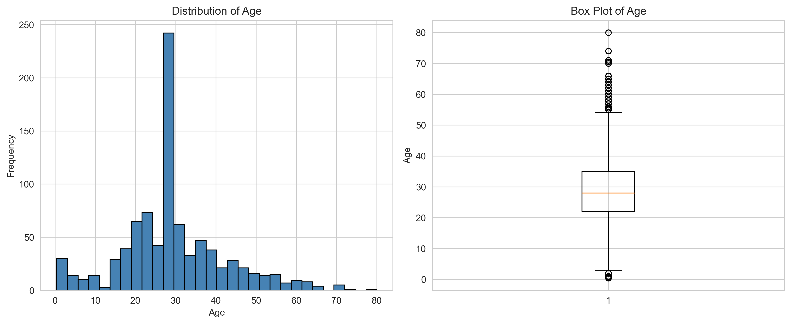
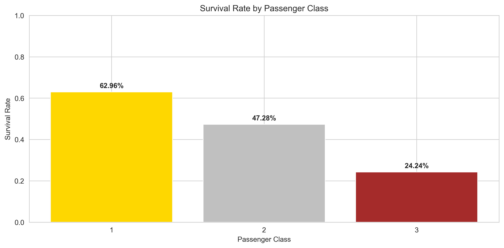
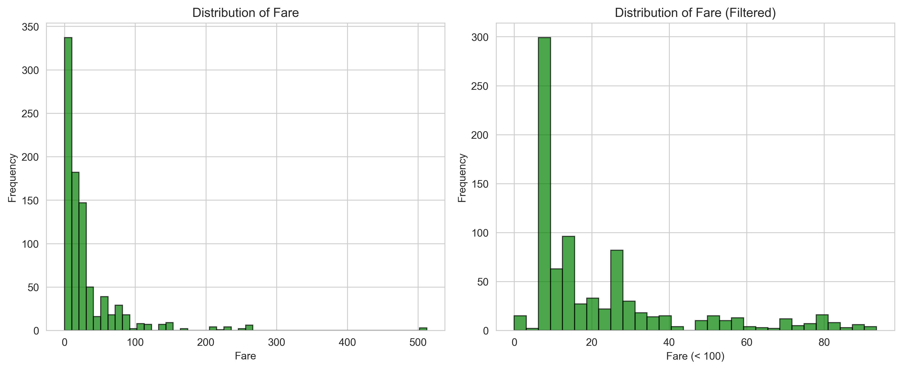
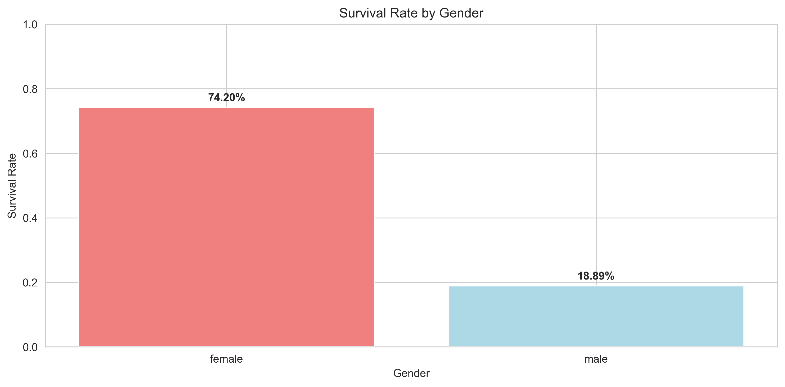
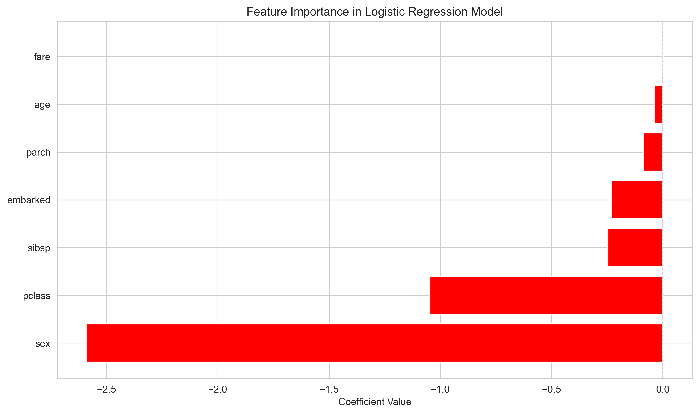
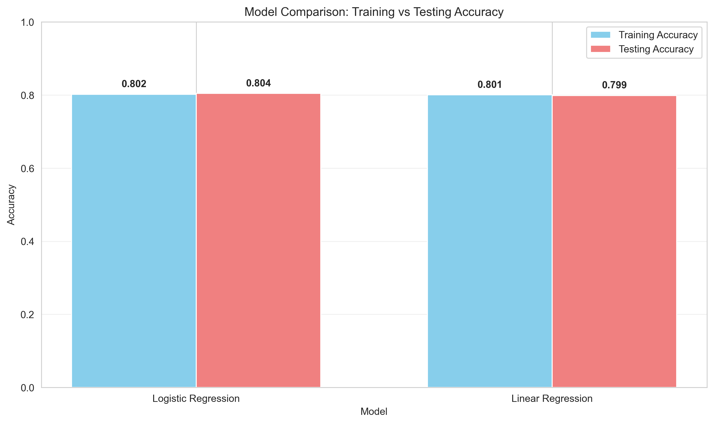
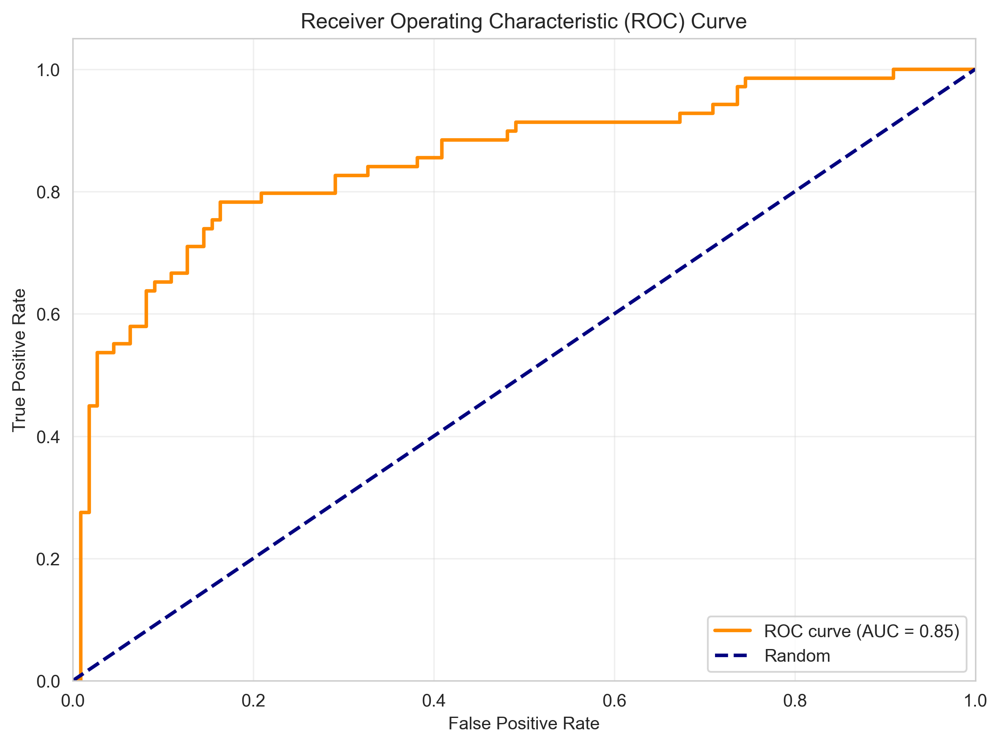
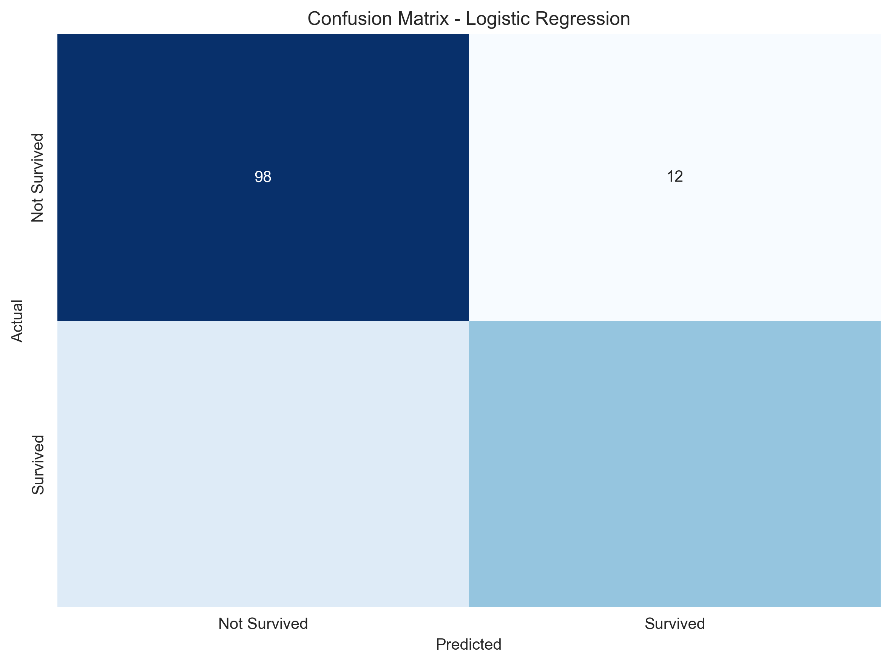

# Titanic Survival Analysis & Classification

## 📌 Overview
This project showcases an end-to-end Machine Learning pipeline focusing on **Exploratory Data Analysis (EDA)** and **Binary Classification**. Using the famous Titanic dataset, the goal of this project was to analyze survival patterns and build a predictive model to determine passenger survival based on factors such as class, gender, age, and fare.

## 🔍 Exploratory Data Analysis (EDA)

Comprehensive data cleaning and missing value imputation were performed. Below are key visual insights extracted during the EDA phase:

| Age & Fare Distribution | Survival Demographics |
| :---: | :---: |
|  |  |
|  |  |

*Insights:* Passenger class and gender were heavily correlated with survival rates. First-class passengers and females had significantly higher chances of survival.

## 🤖 Modeling Approach

The problem was framed as a binary classification task. 

1. **Feature Engineering:** Categorical variables (Sex, Embarked) were encoded using `LabelEncoder`. Missing values in Age, Fare, and Embarked were imputed using median and mode strategies to prevent data leakage.
2. **Algorithms Tested:** Logistic Regression and Linear Regression (used as a baseline comparison).
3. **Evaluation Metrics:** Accuracy, Confusion Matrix, Classification Report, and ROC AUC.

## 📊 Results & Model Evaluation

Logistic Regression significantly outperformed the Linear Regression baseline for this classification task.

| Feature Importance | Model Comparison |
| :---: | :---: |
|  |  |

| Receiver Operating Characteristic | Confusion Matrix |
| :---: | :---: |
|  |  |

- **Training Accuracy:** ~80%
- **Testing Accuracy:** ~81%
- **Key Predictors:** Gender (Sex) was the strongest predictor of survival, followed by Passenger Class (Pclass) and Age.

## 💻 How to Run
1. Ensure you have `pandas`, `numpy`, `matplotlib`, `seaborn`, and `scikit-learn` installed.
2. Run the `Titanic_EDA_and_Classification.py` script.
3. The script will automatically clean the data, train the models, output the metrics to the console, and generate the visualization plots in the current directory.

---
*This project is part of my professional Machine Learning Engineering portfolio.*
