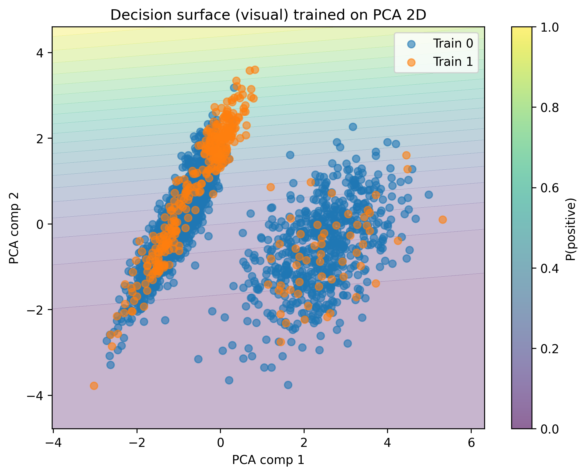
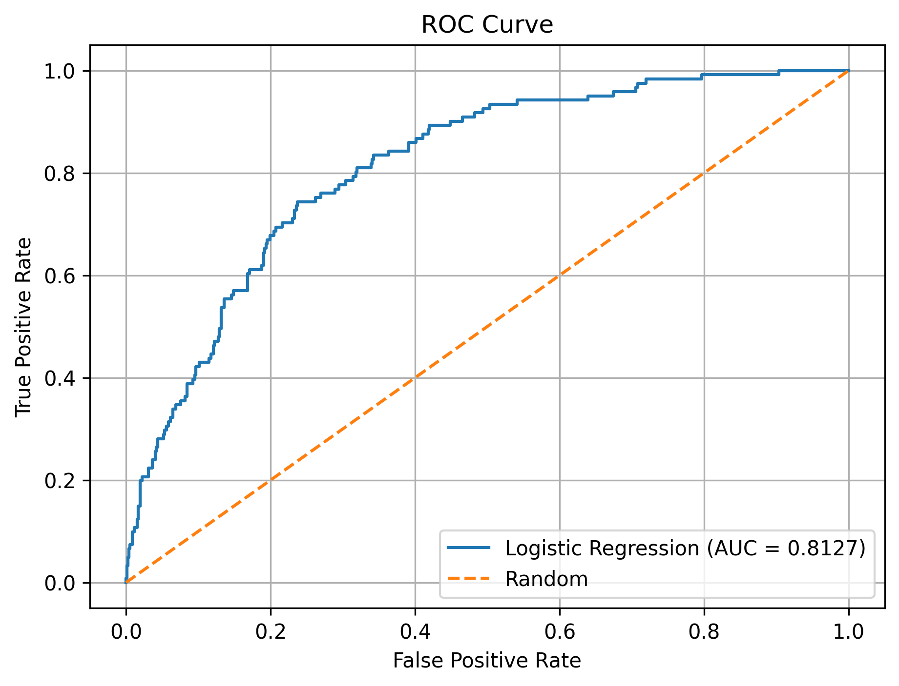
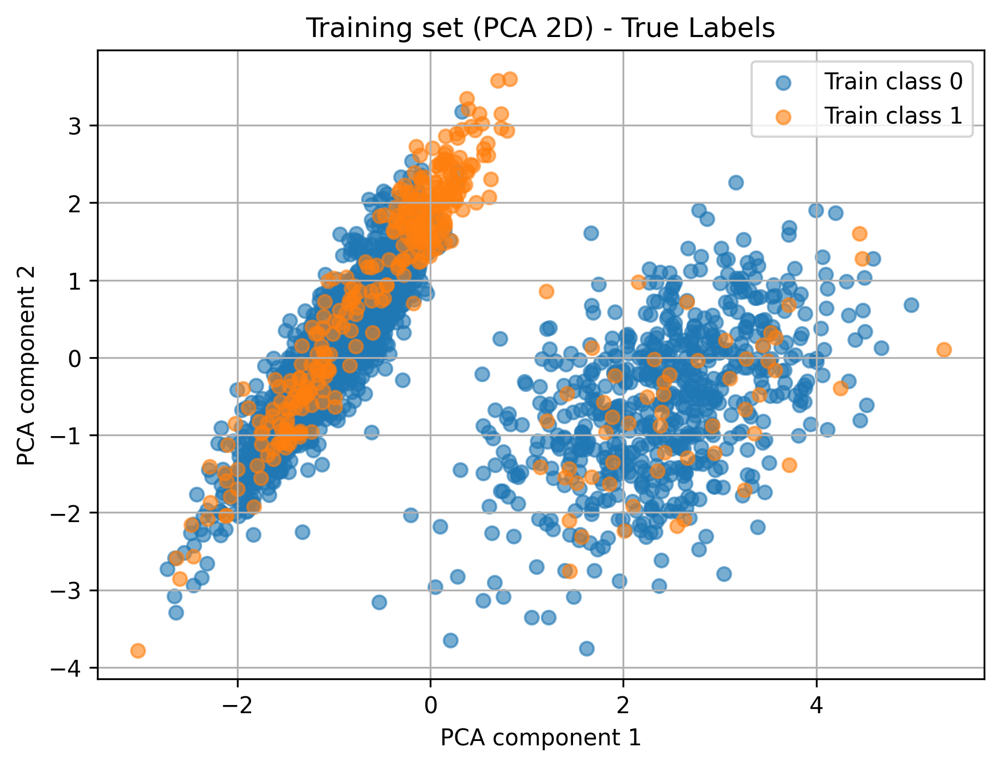
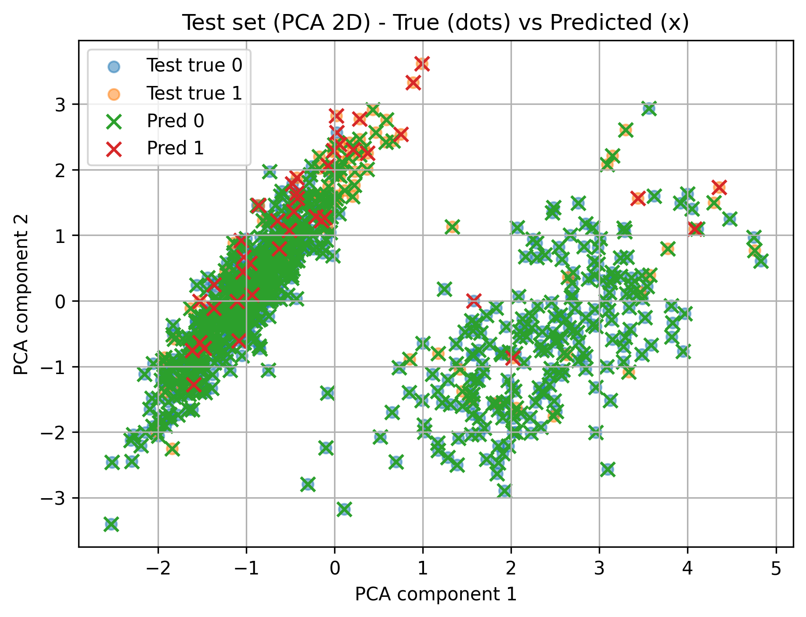
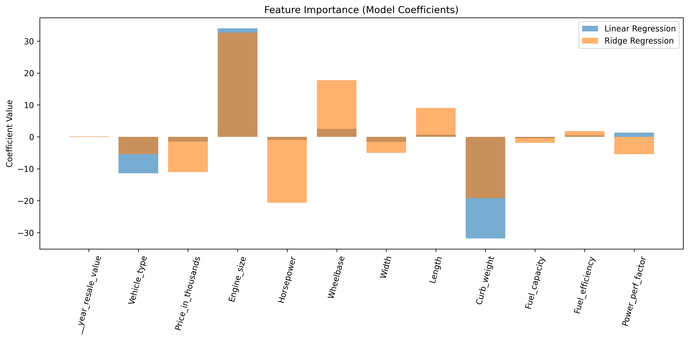

# Linear Models: Classification and Regression

## 📌 Overview
This repository module demonstrates the application of fundamental Linear Machine Learning models on real-world datasets. It is split into two distinct projects:
1. **Telecom Churn Prediction (Classification)**: Using Logistic Regression and Principal Component Analysis (PCA) to predict whether a customer will cancel their subscription.
2. **Car Sales Prediction (Regression)**: Using Linear Regression and Ridge Regression with Feature Scaling to predict automotive sales figures.

## 📞 Project 1: Telecom Churn Prediction
### Methodology
- **Data Preprocessing:** Handled missing values using median/mode imputation and applied One-Hot Encoding for categorical features.
- **Dimensionality Reduction:** Applied Principal Component Analysis (PCA) to visualize the multi-dimensional dataset in a 2D space.
- **Modeling:** Trained a `LogisticRegression` classifier, utilizing `StandardScaler` to normalize the feature distribution.

### Evaluation & Results
The Logistic Regression model was evaluated using a Confusion Matrix, Precision/Recall, and ROC AUC.

| PCA Decision Surface | Receiver Operating Characteristic |
| :---: | :---: |
|  |  |

| PCA Training Set | PCA Test Set Predictions |
| :---: | :---: |
|  |  |

## 🚗 Project 2: Car Sales Prediction
### Methodology
- **Objective:** Predict `Sales_in_thousands` based on car attributes (Engine Size, Horsepower, Curb Weight, etc.).
- **Modeling:** Compared standard Ordinary Least Squares (OLS) **Linear Regression** against L2-Regularized **Ridge Regression**.

### Evaluation & Results
The models were evaluated based on Mean Squared Error (MSE) and R-Squared ($R^2$). Ridge Regression effectively penalized large coefficients, demonstrating the impact of regularization on feature importance.

*The chart above illustrates the difference in feature coefficients between standard Linear Regression and Ridge Regression after standard scaling.*

## 💻 How to Run
1. Ensure you have `pandas`, `numpy`, `matplotlib`, and `scikit-learn` installed.
2. Run the specific pipeline script you wish to evaluate:
   - `python telecom_churn_logistic_regression.py`
   - `python car_sales_ridge_regression.py`
3. The scripts will process the datasets natively, print out evaluation metrics, and export the visualizations as `.png` files.

---
*This project is part of my professional Machine Learning Engineering portfolio.*
