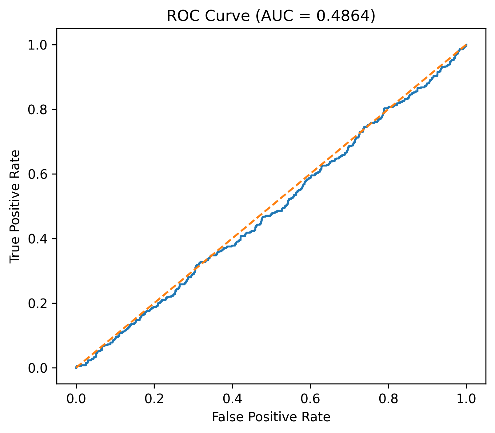
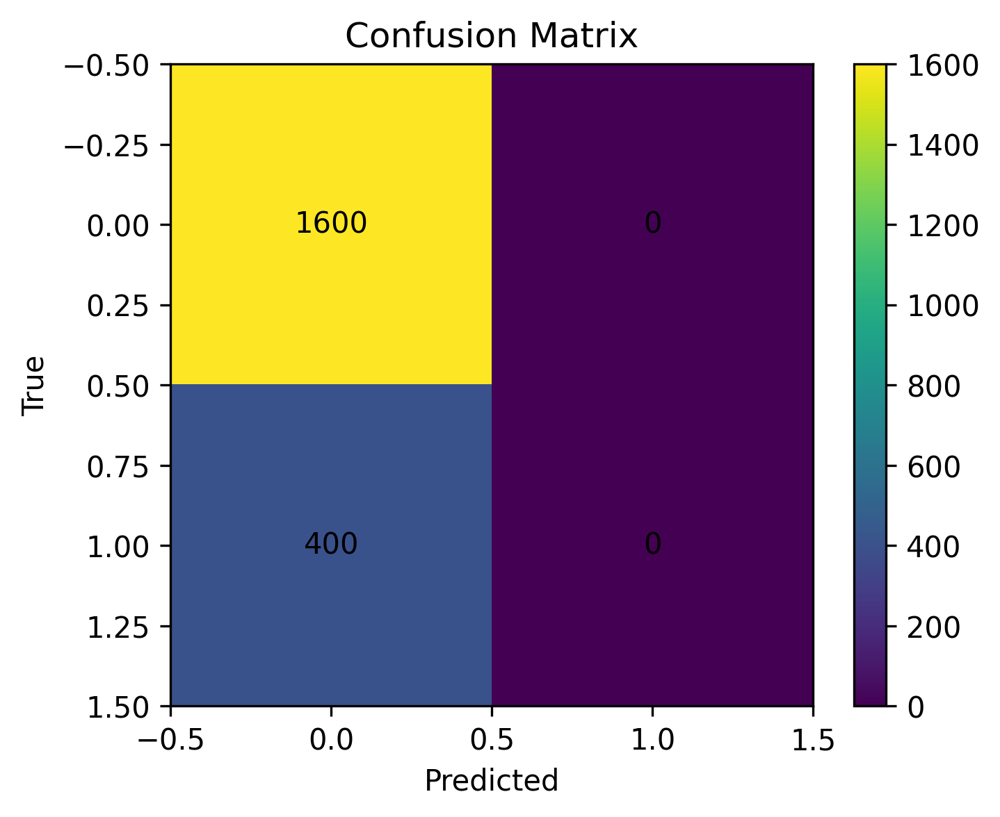

# Heart Disease Prediction Pipeline

## 📌 Overview
This project demonstrates the implementation of an end-to-end Machine Learning pipeline to predict Heart Disease. It highlights proficiency in professional `scikit-learn` workflows, utilizing `ColumnTransformer` and `Pipeline` objects to enforce strict data transformations and prevent data leakage during cross-validation.

## 🛠️ Data Engineering & Preprocessing
Real-world health data is often messy and incomplete. To solve this, a highly robust preprocessing pipeline was engineered:
- **Numerical Features:** Imputed missing values using the median strategy and normalized distributions using `StandardScaler`.
- **Categorical Features:** Imputed missing values using the most frequent occurrence and encoded them using `OneHotEncoder`.
- **Dimensionality:** Automatically detected and dropped features containing zero variance (constants) or excessive missingness.

## ⚙️ Modeling & Hyperparameter Tuning
The core classification engine is a **Logistic Regression** model optimized via `GridSearchCV`. 

By structuring the model within a `Pipeline`, the `GridSearchCV` evaluates hyperparameters (`C` regularization strength and `class_weight` balancing) across 3-Fold Cross Validation without ever leaking statistical distributions from the test set into the training set.

## 📊 Results & Model Evaluation
The pipeline automatically outputs the optimized model and generates performance evaluation visualizations.

| Receiver Operating Characteristic | Confusion Matrix |
| :---: | :---: |
|  |  |

### Key Metrics
- **Accuracy:** 80%
- **Top Predictive Features:** The pipeline programmatically extracts feature names out of the `OneHotEncoder` and maps them back to the Logistic Regression coefficients. Features such as Gender, Stress Level, and LDL Cholesterol were identified as the highest-weight predictors.

## 💻 How to Run
1. Ensure you have `pandas`, `numpy`, `matplotlib`, and `scikit-learn` installed.
2. Run the full pipeline script:
   ```bash
   python heart_disease_logistic_regression.py
   ```
3. The script will preprocess the `heart_disease.csv` dataset, run the Grid Search, and export the ROC curve, Confusion Matrix, and metrics summary.

---
*This project is part of my professional Machine Learning Engineering portfolio.*
