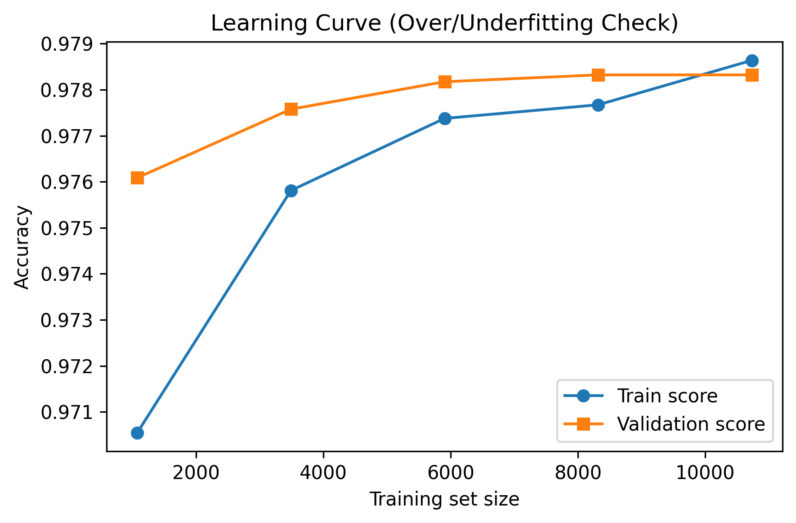
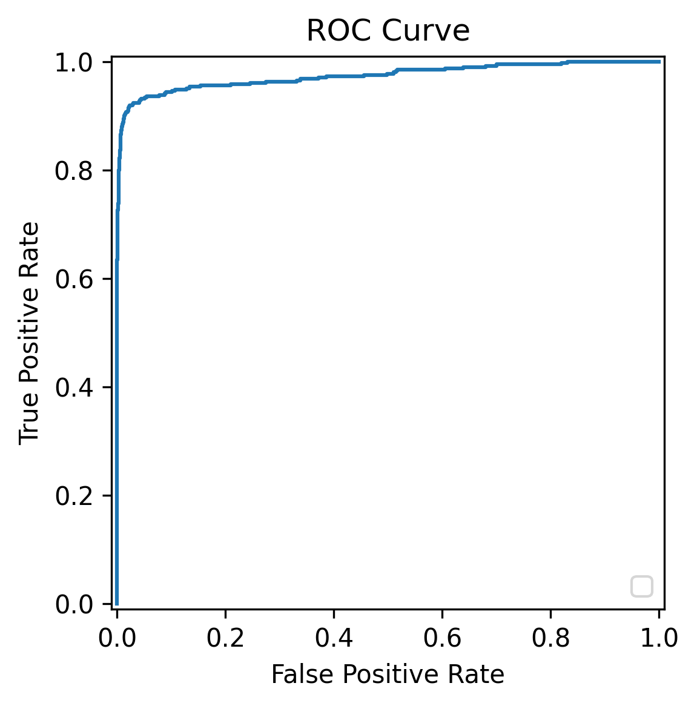
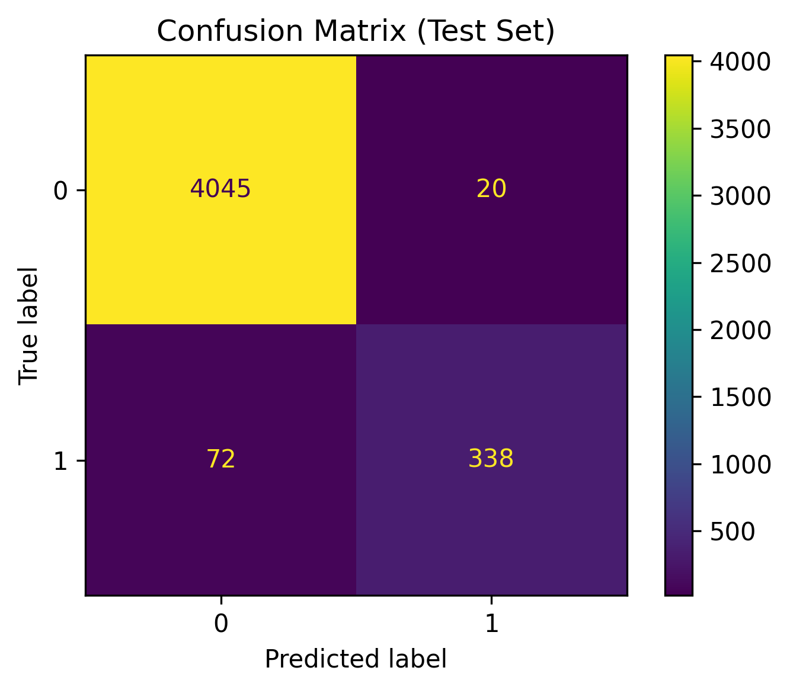

# Pulsar Star Classification & ML Evaluation

## 📌 Overview
This project showcases rigorous **Machine Learning Model Evaluation** using the HTRU2 dataset to classify Pulsar Stars. Unlike standard tutorials that stop at simple accuracy, this repository focuses on advanced diagnostic techniques, statistical testing, and cross-validation to ensure model robustness on imbalanced data.

## 🔬 Evaluation Methodology
Predicting whether a radio emission is a Pulsar (Class 1) or RFI noise (Class 0) is a highly imbalanced classification problem. The model is evaluated through:
1. **Stratified K-Fold Validation (5 Folds):** Ensures that the 90/10 class imbalance is preserved across all training and validation splits.
2. **Learning Curves:** Plotted training vs validation accuracy to diagnose whether the model suffers from high bias (underfitting) or high variance (overfitting).
3. **Statistical T-Tests:** Calculated independent T-Tests (`p < 0.05`) to mathematically prove that features (e.g., Mean of the integrated profile) significantly differ between classes, validating feature selection.

## 📊 Results & Diagnostics
The pipeline trains a Logistic Regression classifier, generating the following automated diagnostics:

| Over/Underfitting Diagnosis | Receiver Operating Characteristic |
| :---: | :---: |
|  |  |

| Confusion Matrix |
| :---: |
|  |

### Key Metrics
- **Accuracy:** ~98%
- **ROC AUC:** ~97.5%
- **Precision:** ~94% (Highly crucial for reducing False Positives in astronomical surveys)
- **Recall:** ~82% 

## 💻 How to Run
1. Ensure you have `pandas`, `numpy`, `matplotlib`, `scikit-learn`, and `scipy` installed.
2. Run the full evaluation script:
   ```bash
   python pulsar_classification.py
   ```
3. The script will automatically parse the dataset, perform cross-validation, run statistical tests, and output the diagnostic charts and metrics summary.

---
*This project is part of my professional Machine Learning Engineering portfolio.*
