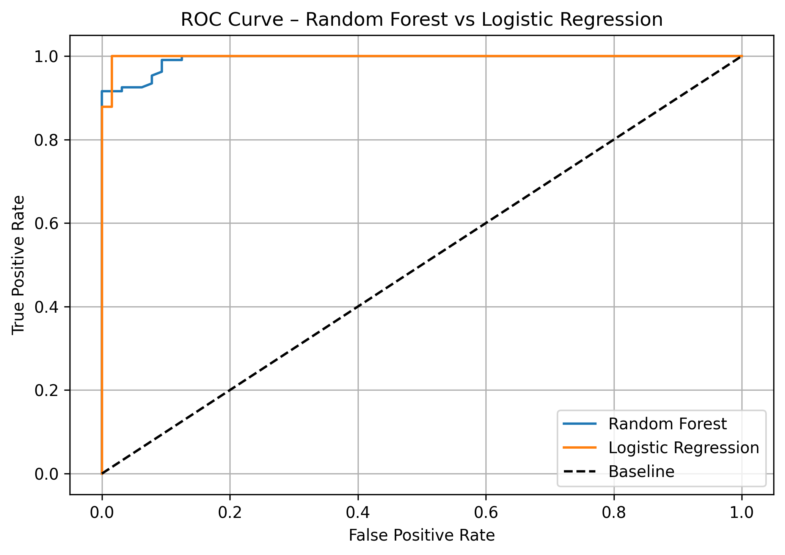
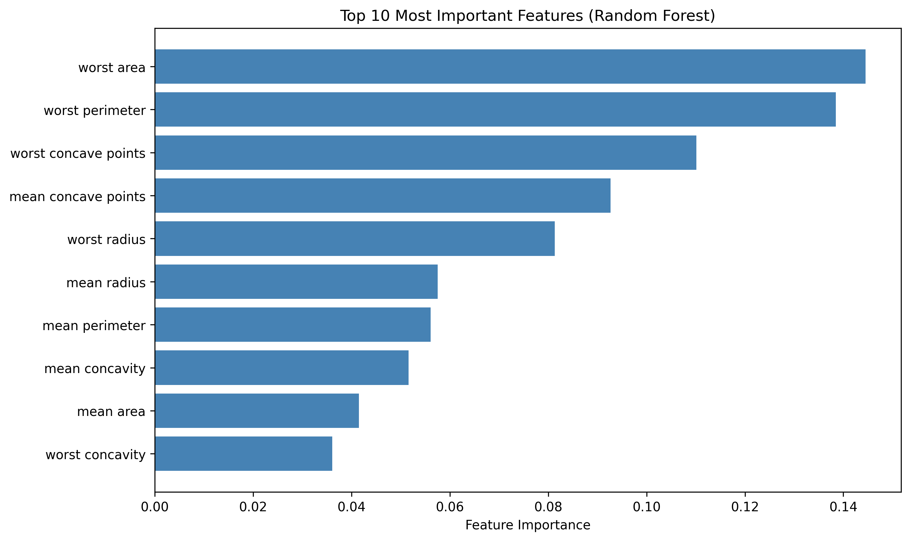

# Breast Cancer Classification (Ensemble vs Linear)

## 📌 Overview
This project focuses on comparing the diagnostic capabilities of an advanced Ensemble model (**Random Forest Classifier**) against a baseline linear model (**Logistic Regression**) using the Wisconsin Breast Cancer (Diagnostic) dataset. It demonstrates how to handle mild class imbalance, implement feature scaling, and evaluate models using rigorous medical diagnostic metrics.

## 🔬 Methodology
The objective is to accurately classify tumors as either *Malignant* or *Benign* based on 30 geometric cell features (e.g., radius, texture, perimeter).
1. **Data Preprocessing:** Standardized all 30 continuous features using `StandardScaler` to ensure the Logistic Regression gradient descent converges optimally.
2. **Model Training:** 
   - Trained a 200-tree `RandomForestClassifier` with balanced class weights to penalize false negatives (missed diagnoses).
   - Trained a standard `LogisticRegression` baseline model using the LBFGS solver.
3. **Evaluation Strategy:** Because this is a medical context, maximizing *Recall* (minimizing False Negatives) is prioritized alongside overall Accuracy and ROC-AUC.

## 📊 Evaluation & Diagnostics

Both models performed exceptionally well, achieving ~99% accuracy. However, plotting the comparative ROC curves visualizes the marginal superiority of the Random Forest ensemble on this dataset.

| ROC Curve Comparison | Top 10 Feature Importances |
| :---: | :---: |
|  |  |

### Key Insights
By extracting the `feature_importances_` array from the Random Forest, we mathematically determine which cell characteristics are most predictive of malignancy:
1. **Worst Area (~14.4%)**
2. **Worst Perimeter (~13.8%)**
3. **Worst Concave Points (~11.0%)**

These features mathematically confirm that larger, more irregularly shaped cells are the strongest indicators of cancerous tumors.

## 💻 How to Run
1. Ensure you have `pandas`, `numpy`, `matplotlib`, and `scikit-learn` installed.
2. Run the pipeline script:
   ```bash
   python breast_cancer_classification.py
   ```
3. The script will automatically load the dataset from the Scikit-Learn API, train both models, print the classification reports to the console, and generate the comparative diagnostic plots.

---
*This project is part of my professional Machine Learning Engineering portfolio.*
