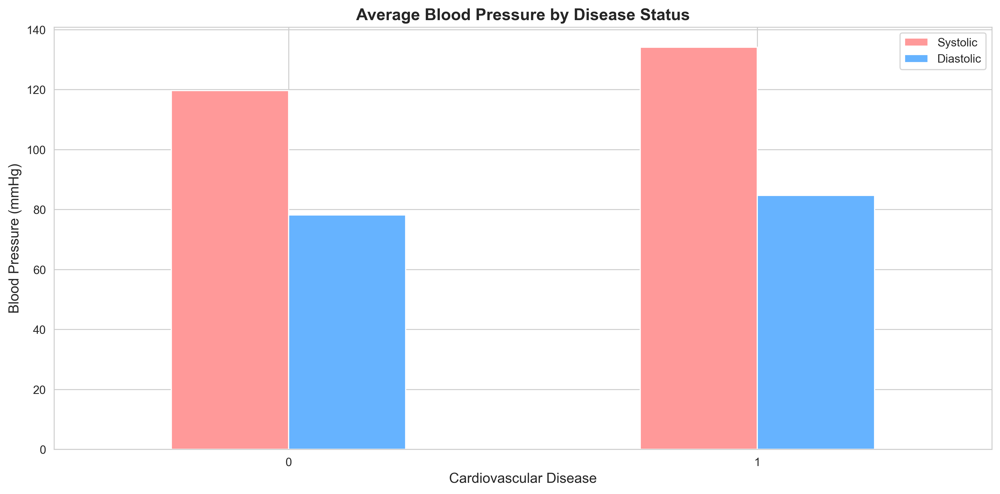
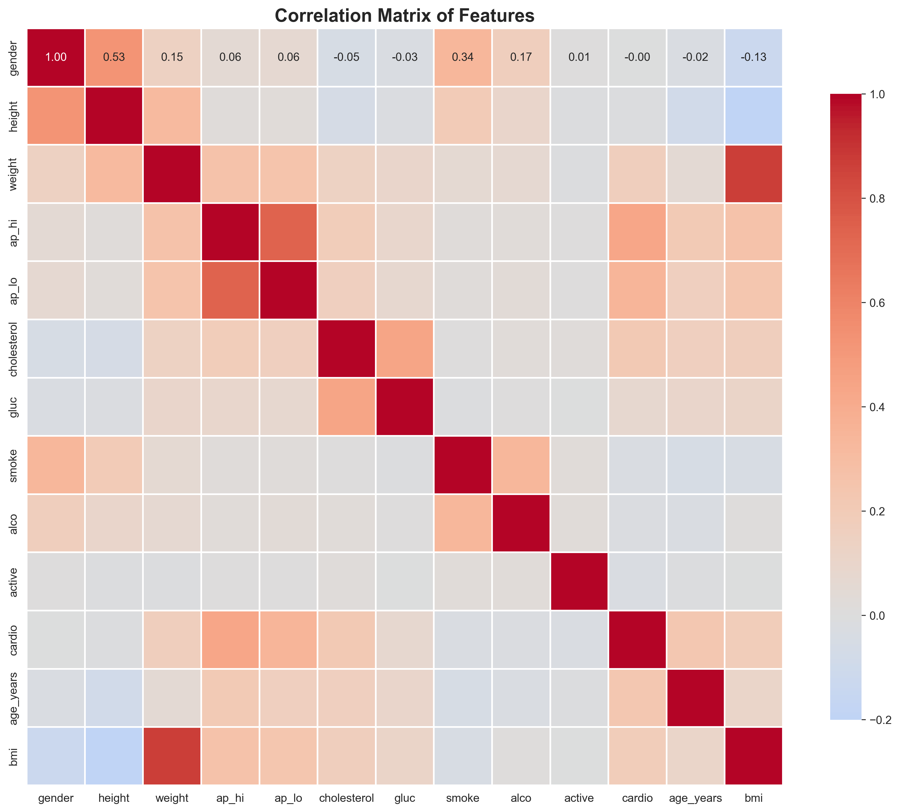
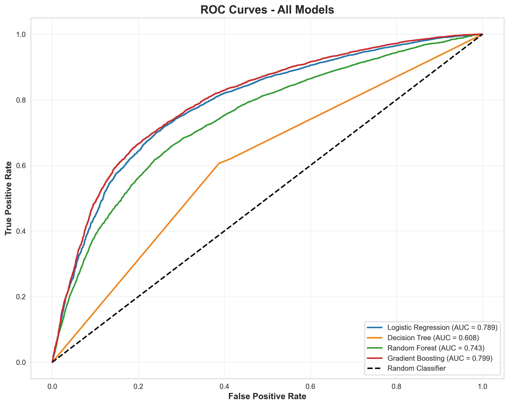
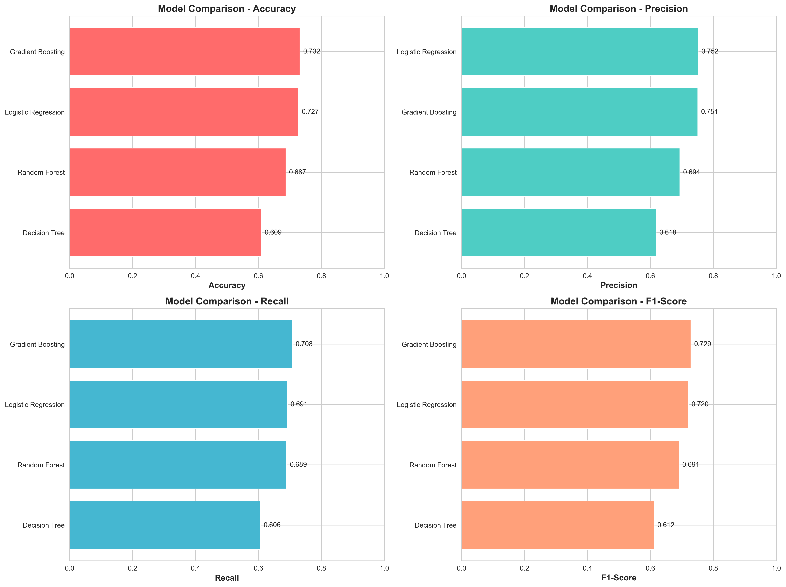

# Cardiovascular Disease Prediction

## 📌 Overview
This project focuses on predicting the presence of Cardiovascular Disease (CVD) based on 70,000 patient records. It demonstrates a complete end-to-end Machine Learning workflow, from rigorous Exploratory Data Analysis (EDA) and handling physiological outliers to building, comparing, and hyperparameter-tuning multiple classification models.

## 🔬 Data Preprocessing & EDA
Medical datasets contain extreme physiological outliers that must be handled before feeding into statistical models.
- **Data Cleaning:** Filtered out logically impossible blood pressure records (e.g., negative values or diastolic > systolic) and extreme height/weight anomalies.
- **Feature Engineering:** Calculated **Body Mass Index (BMI)** and **Pulse Pressure** (Systolic - Diastolic) from raw clinical features to give the models stronger physiological signals.
- **Visualization:** Analyzed distributions and cross-tabulations of demographics, habits (smoking/alcohol), and blood pressure against cardiovascular outcomes.

| Blood Pressure Distribution | Correlation Matrix |
| :---: | :---: |
|  |  |

## ⚙️ Model Architecture & Evaluation
To determine the best predictive engine, four machine learning algorithms were trained and evaluated on the normalized dataset (`StandardScaler`):
1. **Logistic Regression** (Baseline)
2. **Decision Tree Classifier**
3. **Random Forest Classifier**
4. **Gradient Boosting Classifier**

| Multi-Model ROC Curves | Algorithm Comparison |
| :---: | :---: |
|  |  |

### Hyperparameter Tuning (GridSearchCV)
The **Gradient Boosting** and **Random Forest** ensembles proved to be the strongest performers. To squeeze maximum performance without overfitting, a rigorous `GridSearchCV` was applied to optimize the depth and splitting criteria.

### Feature Importance Diagnostics
By analyzing the optimized tree-based models, the pipeline extracts the physiological features that mathematically carry the highest predictive weight. Features such as **Systolic Blood Pressure (ap_hi)** and **Age** consistently ranked as the most critical risk factors.

## 💻 How to Run
1. Ensure you have `pandas`, `numpy`, `seaborn`, `matplotlib`, and `scikit-learn` installed.
2. Download the `cardio_train.csv` dataset and place it in the root directory.
3. Run the pipeline script:
   ```bash
   python cardiovascular_disease_prediction.py
   ```
4. The script will automatically clean the data, generate 10 statistical visualizations, evaluate all models, tune the best model via Grid Search, and export its logs.

---
*This project is part of my professional Machine Learning Engineering portfolio.*
