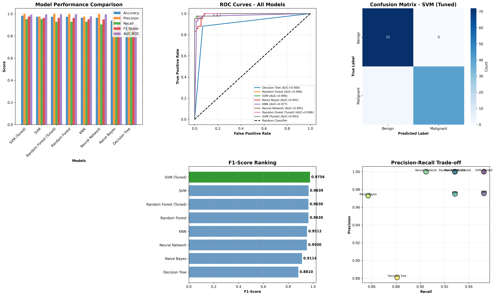
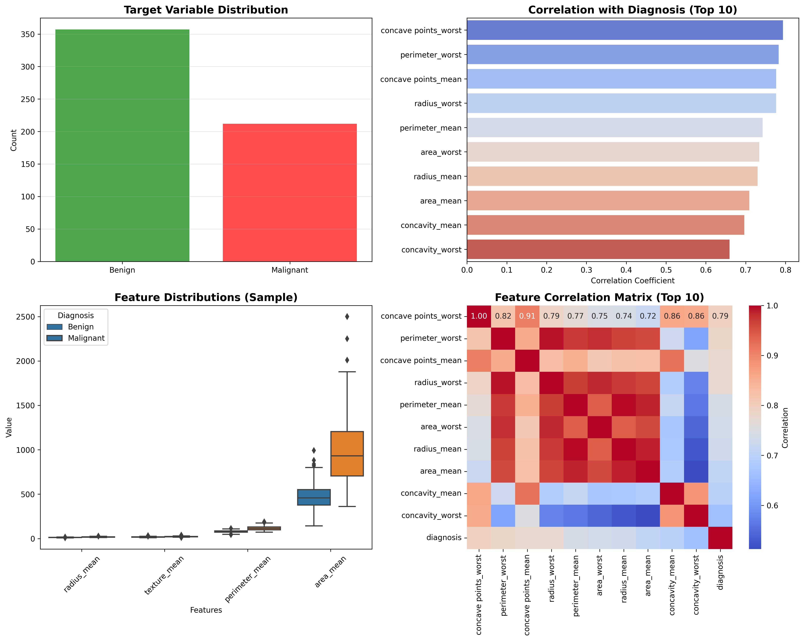

# Breast Cancer Diagnostic Pipeline (MLOps)

## 📌 Overview
This project showcases a complete Machine Learning Deployment Pipeline for Breast Cancer Diagnostics. Unlike introductory projects, this repository emphasizes **MLOps principles**: handling extreme class imbalances via SMOTE, exhaustive grid-search tuning, model serialization (`joblib`), and rigorous evaluation across 6 distinct algorithmic architectures.

## 🔬 Data Preprocessing & Balancing
Medical datasets inherently suffer from class imbalance (e.g., more benign tumors than malignant ones). If left untreated, algorithms become biased towards predicting the majority class.
- **SMOTE Integration:** Implemented the Synthetic Minority Over-sampling Technique (SMOTE) to mathematically generate synthetic samples of the minority class, enforcing a perfectly balanced training environment.
- **Normalization:** Scaled all 30 geometrical tumor features (Radius, Texture, Perimeter, etc.) using `StandardScaler` to optimize gradient descent and distance-based algorithms.
- **Serialization:** Exported the fitted scaler as `scaler.pkl` to assure that any new patient data sent to the production model is normalized on the exact same mathematical scale as the training set.

## ⚙️ Algorithmic Comparison
The pipeline evaluates and compares 6 distinct algorithmic families:
1. **Decision Tree**
2. **Random Forest** (Ensemble)
3. **Support Vector Machine (SVM)**
4. **Gaussian Naive Bayes**
5. **K-Nearest Neighbors (KNN)**
6. **Multi-Layer Perceptron (Neural Network)**

### Exhaustive Hyperparameter Tuning
The top-performing algorithms (Random Forest and SVM) underwent rigorous `GridSearchCV` tuning using 5-Fold Cross Validation.

| Model Comparison | Exploratory Data Analysis |
| :---: | :---: |
|  |  |

## 🚀 Deployment Artifacts
After determining the supreme algorithm, the pipeline automatically serializes the mathematically optimized weights using `joblib`.
- **`best_model.pkl`**: The production-ready inference engine.
- **`scaler.pkl`**: The normalization parameters for new input vectors.
- **`model_comparison_results.csv`**: A structured log of validation metrics for compliance/audit purposes.

## 💻 How to Run
1. Ensure you have `pandas`, `numpy`, `matplotlib`, `seaborn`, `imbalanced-learn`, and `scikit-learn` installed.
2. Run the pipeline script:
   ```bash
   python breast_cancer_deployment_pipeline.py
   ```
3. The script will ingest the clinical CSV, apply SMOTE, tune the models, generate diagnostic visuals, and output the `.pkl` artifacts directly to the working directory.

---
*This project is part of my professional Machine Learning Engineering portfolio.*
